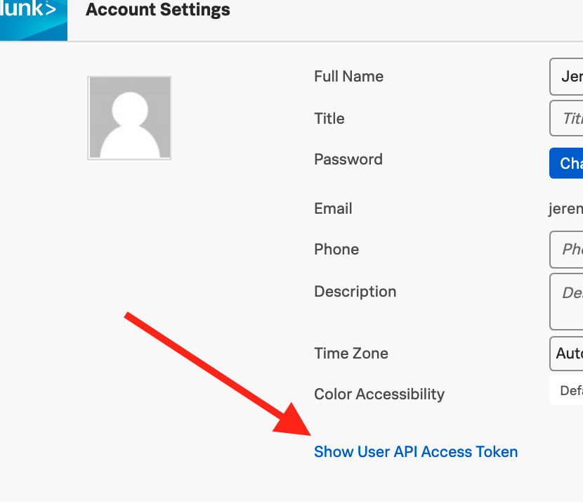
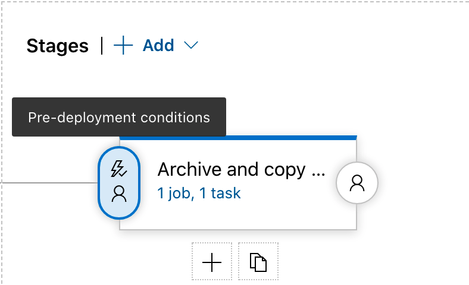

# azure-devops-splunk-detector-gate
Add Azure DevOps Release Gates based on the status of detectors in Splunk Observability Cloud.

## Setup your Service Connection
After installing the Splunk Alert Gates extension you will need to setup 
your Splunk API Service Endpoint 
1. Click Project Settings from the bottom left side of your screen in the main Azure DevOps Project area
2. Click Service Connections from the Pipelines area of Project Settings
3. Click New Service Connection in the top right
4. Choose the Splunk API Service Endpoint as your new service connection
5. Enter your Splunk Observability Cloud User API token which you obtained from Splunk Observability Cloud > Account Settings. 

## Setup your Release Pipeline to check a Detector
1. Edit your Release Pipeline by clicking Releases under the Pipeline heading in the left sidebar
2. Select your Release Pipeline and click the Edit button in the upper right
3. Click either Pre-Deployment or Post-Deployment conditions 
    
4. Enable Gates and click Add to add your Splunk Detector Gate configuration
    - Include the Detector Id of the detector you'd like to use as your gate.